# PYTHON FOR DATA ANALYTICS AND BUSINESS INTELLIGENCE
This work is a series of different projects with each diving into the deep concept of using Python for data analytics and building deep insights in business intelligence.

## OVERVIEW
- Project 1 - Python for Data Analytics Introductory Hands-on with practise questions and answers.

- Project 2 - Python for Data Analytics on the E-Commerce Purchases and this project delve into the real-world data analytics on an e-commerce purchases.

- Project 3 - Python for Data Analytics on the San Francissco City Employee Salaries and I delved into the real-world insights of the differentials in salaries and other benefits of employees.

- Project 4 - End to End Customer Shopping Behaviour Analytics with Python, SQL and Power BI.

# **END TO END CUSTOMER BEHAVIOUR ANALYTICS**

### **PROJECT OVERVIEW**
This project analyses the customer shopping behaviour using the customer transactional data from 3,900 purchases across various product categories.
The goal is to uncover insights into spending patterns, customer segmentation analytics, product preferences, and subscription behaviour to guide strategic business decisions.
  
##### **Project workflow**
 
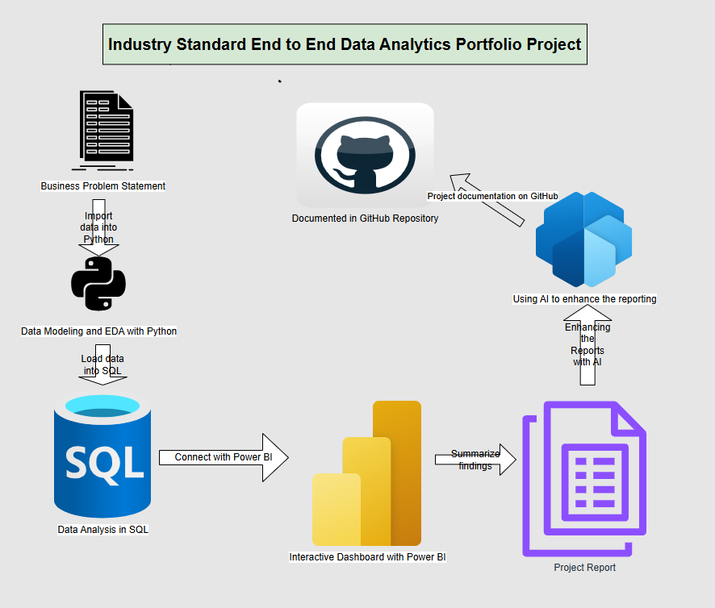

##### **Business Problem Statement**

*A leading retail company wants to better understand its customers' shopping behaviour in order to improve sales, customer satisfaction, and long-term loyalty. The management team has noticed changes in purchasing patterns across demographics, product categories, and sales channels (online vs offline). They are particularly interested in uncovering which factors, such as discounts, reviews, seasons, or payment preferences, drive consumer decisons and repeat purchases.*

*You are tasked with analyzing the company's consumer behaviour dataset to answer the following overarching business question:* `How can the company leverage consumer shopping data to identify trends, improve customer engagement, and optimize marketing and product strategies?`

##### **Project Deliverables**

   1. `Data Preparation and Modeling with Python`: Clean and transform the raw dataset for analysis.
   2. `Data Analysis with SQL`: Organize the data into a structured format, stimulate business transactions, and run queries to extract insights on customer, loyalty, and purchase drivers.
   3. `Visualization and Insights with Power BI`: Build an interactive dashboard that highlights key patterns and trends, enabling stakeholders to make data-driven decisions.
   4. `Report and Presentation`: Write a clear project report summarizing the key findings and business recommendations. Prepare a presentation that visually communicates insights and actionable recommendations to stakeholders.

### **DATASET SUMMARY**
- ROWS: 3,900
- COLUMNS: 18
- KEY FEATURES:
  - Customer Demongraphics (Age, Gender, Location, Subscription Status)
  - Purchase Details (Item Purchase, Category, Purchase Amount, Season, Size, Color)
  - Shopping behaviour (Discount Applied, Promo Code Used, Previous Purchases, Frequency of Purchases, Review Rating, Shipping Type)

- Missing Data: 37 missing values found in review rating columns.

### **EXPLORATORY DATA ANALYSIS WITH PYTHON**
The data preparation and cleaning was done in Python using Pandas and Exploratory Data Analysis Techniques:

  - **Loaded the data**:

  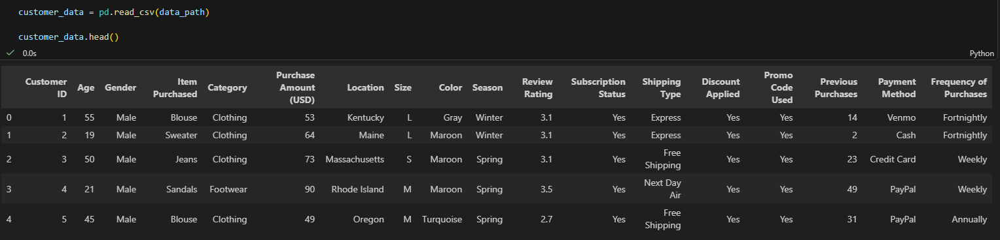

  - **Initial Data Exploratory**:
   
   `df.info() and df.describe()`

   - **Missing Values Handling**:

  Checked the missing or null values using `df.isnull().sum()` and imputed the missing values in the `review_rating` column using the median rating of each product category.

  ```bash
  df['Review Rating'] = df.groupby('Category')['Review Rating'].transform(lambda category: category.fillna(category.median()))
  ```

  - **Column Standardization**:

  For uniform nomeclature, the columns were renamed to snake case to allow easy readability, documentation and inetegration.

  - **Feature Engineering**:

    - Created the `aged_group` column by binning the customer `age` column

   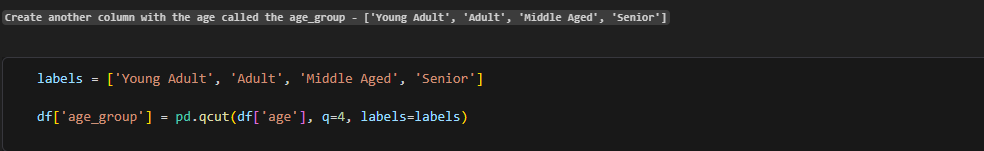

    
    - Created `freq_of_purchases_in_days` column from the `frequency_of_purchases` column using the mapping function

   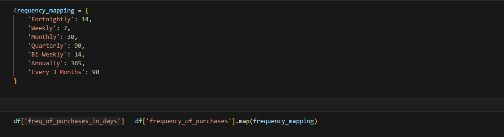

  - **Data Consistency Check**: Verified if the `discount_applied` and `promo_code_used` were redundant and found that they were so, had to dropped the `promo_code_used`.

  - **Database Integration**: Connected Python script to MySQL and loaded the cleaned DataFrame into the MySQL database for SQL analysis.
  ```bash
  !pip install pymysql sqlalchemy  # installing the mysql connector and the sqlachemy

  !pip install python-dotenv  # installing the python dotenv for loading environment variables

  from dotenv import load_dotenv
  import os

  # Loads the .env into the environment variables

  load_dotenv()

  # Importing library
  from sqlalchemy import create_engine

  # Step 1: Connecting to MySQL and Replacing all placeholders with your actual credentials

  username = os.getenv("DB_USER")         # default user
  password = os.getenv("DB_PASSWORD")   # the password you set for your MySQL during installation
  host = os.getenv("DB_HOST")           # if running locally
  port = os.getenv("DB_PORT")                # default MySQL port
  database = os.getenv("DB_NAME")         # the database you created for the project

  engine = create_engine(f"mysql+pymysql://{username}:{password}@{host}:{port}/{database}")

  # Step 2: Load the DataFrame into MySQL

  table_name = "customer"     # choose any table name

  df.to_sql(table_name, engine, if_exists="replace", index=False)

  print(f"Data successfully loaded into the data table name: {table_name} in the database: {database}")

  # Step 3: Read the data to the notebook from the MySQL database
  pd.read_sql(f"SELECT * FROM {table_name} LIMIT 10;", engine)
  ```

  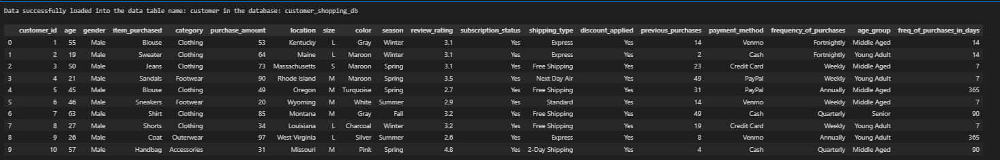


### **DATA ANALYTICS USING SQL**

Performed structured business analysis to answer key business questions to gain insights using MySQL:

`Business Questions and Analysis`

**1. WHAT IS THE TOTAL REVENUE GENERATED BY MALE VS FEMALE CUSTOMERS ?**

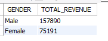

`Male customers generated 2X as more revenues than female customers and this implies that company should increase on the products that attract male customers while running the promotions on the female products in a way to attract its sales.`

**2. WHICH TOP 10 CUSTOMERS USED A DISCOUNT BUT STILL SPENT MORE THAN THE AVERAGE PURCHASE AMOUNT ?**

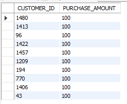

`These customers who used a discount but yet still spent above the average purchase amount represent a customer segment that remains highly valuable despite receiving price reductions. Their behavior suggests strong purchasing power and potentially high loyalty. This group is ideal for targeted premium promotions, upsell opportunities, and personalized retention strategies.`

**3. WHICH ARE THE TOP 5 PRODUCTS WITH THE HIGHEST AVERAGE REVIEW RATING?**

Business Question
  
  Which products have the highest average customer review ratings, and what are the top 5?

Technical Logic
  
  The query calculates the average review rating for each product, rounds it to two decimals, ranks all products by rating in descending order, and returns the top five.

Key Insight
  
  The top five products stand out as the highest‑rated items in the catalog, indicating consistently strong customer satisfaction and perceived value.

Strategic Implications

  - These products are strong candidates for featured placement in marketing campaigns.

  - High ratings suggest they can support premium pricing or reduced discounting.

  - They serve as benchmarks for improving lower‑rated products.

Output

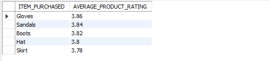


**4. COMPARE THE AVERAGE PURCHASE AMOUNTS BETWEEN STANDARD AND EXPRESS SHIPPING**

`Business Question`: How does the average purchase amount differ between customers using Standard shipping and those using Express shipping?

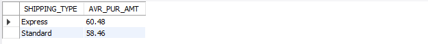

`The results reveal how customers' spending behavior varies by the choice of shipping preference. This answers the question why Express users tend to make higher‑value purchases and contribute more to the revenue on average that the Standard users.`

**5. DO SUBSCRIBED CUSTOMERS SPEND MORE? COMPARE AVERAGE SPEND AND TOTAL REVENUE BETWEEN SUBSCRIBERS AND NON-SUBSCRIBERS**

`Business Question:` Do subscribed customers spend more than non‑subscribers, and how do their average spend and total revenue contributions compare?


`The results clearly show how subscribers and non‑subscribers differ in both spending behavior and revenue contribution. This highlights whether the subscription program is attracting higher‑value customers or if non‑subscribers still drive a significant share of revenue.`

**6. WHICH 5 PRODUCTS HAVE THE HIGHEST PERCENTAGE OF PURCHASES WITH DISCOUNTS APPLIED?**

`Business Question:` Which five products have the highest percentage of purchases made with discounts applied?

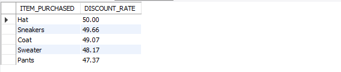

`These five products have the highest reliance on discounts to drive sales, indicating that customers are more likely to purchase them when a price reduction is offered.`

**7. SEGMENT CUSTOMERS INTO NEW, RETURNING, AND LOYAL BASED ON THEIR TOTAL NUMBER OF PREVIOUS PURCHASES, AND SHOW THE COUNT OF EACH SEGMENT.**

`Business Question:` How many customers fall into the New, Returning, and Loyal segments based on their total number of previous purchases?

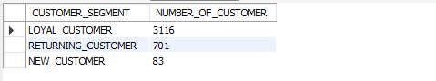

`The segmentation reveals the distribution of customers across New, Returning, and Loyal groups, offering a clear view of customer maturity and engagement levels within the business.`

**8. WHAT ARE THE TOP 3 MOST PURCHASED PRODUCTS WITHIN EACH CATEGORY?**

`Business Question:` What are the top three most purchased products within each product category?

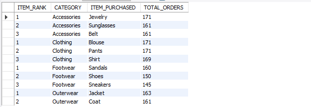

`Each category’s top‑selling products emerge clearly, highlighting which items consistently drive the highest order volumes within their respective categories.`

`Strategic Implications:`

- *These products are strong candidates for category‑level promotions, bundling, and featured placement.*

- *Helps identify which items anchor demand within each category, guiding inventory and supply planning.*

- *Useful for benchmarking lower‑performing products and refining category management strategies.*


**9. ARE THOSE CUSTOMERS WHO ARE REPEAT BUYERS (MORE THAN 5 PREVIOUS PURCHASES) ALSO LIKELY TO SUBSCRIBE?**

`Business Question:` Are repeat buyers (customers with more than five previous purchases) more likely to be subscribers?


`The results show how strongly repeat purchasing behavior aligns with subscription adoption. This reveals whether loyal, high‑engagement customers tend to convert into subscribers.`

`Strategic Implications:`

 - *If most repeat buyers are subscribers, the subscription model is effectively capturing high‑value customers.*

 - *If many repeat buyers are not subscribed, targeted subscription campaigns could unlock significant additional revenue.*

 - *Helps refine retention and loyalty strategies by understanding the overlap between repeat purchasing and subscription behavior.*

**10. WHAT IS THE REVENUE CONTRIBUTION OF EACH AGE GROUP?**

`Business Question:` Which age groups contribute the most revenue, and how does revenue distribution vary across demographic segments?

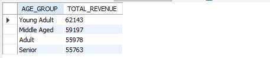

`The results highlight which age groups are the strongest revenue drivers, revealing the demographic segments that generate the highest financial value for the business.`

`Strategic Implications:`

- *High‑revenue age groups should be prioritized for targeted marketing, loyalty programs, and retention strategies.*

- *Lower‑revenue segments may require tailored engagement or product‑market fit adjustments.*

- *Supports demographic‑based forecasting and resource allocation for future growth.*

### **DASHBOARDING IN POWER BI**

The interactive dashboard allows for business insights with deep dive into the dataset by connecting the Power BI directly to MySQL database for integration.

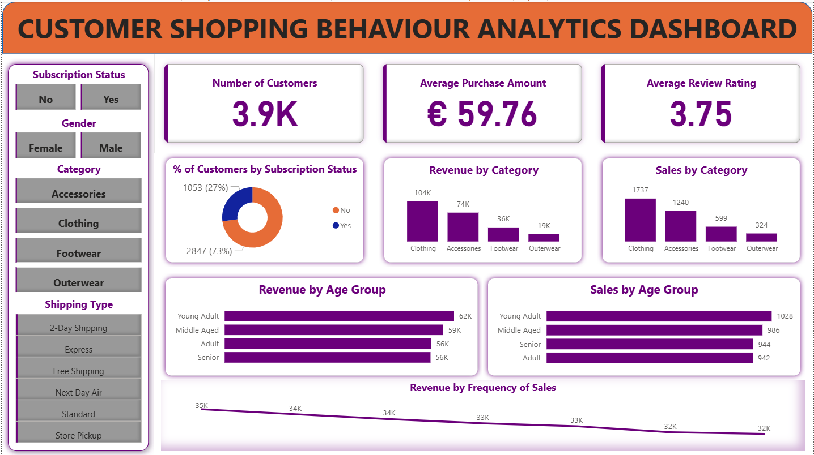

The customer activity shows strong engagement across the platform, with `3900` total customers, an average purchase amount of `€59.76`, and an average review rating of `3.75`. Subscription penetration is still an opportunity area: only `27%` of customers are subscribers, while `73%` are non‑subscribers, indicating substantial headroom to grow recurring relationships and loyalty.

Revenue performance is led by `Clothing (€104K)` and `Accessories (€74K)`, which together form the commercial core of the business. These categories also dominate sales volume, confirming consistent customer demand. In contrast, Footwear and Outerwear contribute significantly less, suggesting opportunities for product improvement, repositioning, or targeted promotions.

Demographically, `Young Adults` generate the highest revenue `(€62K)` and lead in sales volume, making them the most valuable age segment. Middle‑Aged, Adult, and Senior groups follow closely, each contributing meaningful revenue, indicating a balanced customer base with multi‑segment potential.

Overall, the report highlights a business driven by strong performance in key categories and a clear demographic sweet spot among younger shoppers, while revealing a major growth lever in converting more of the large non‑subscriber base into active subscribers.

### **BUSINESS RECOMMENDATIONS**

`Grow subscriptions:` With 73% non‑subscribers, focus on targeted conversion campaigns and stronger subscription incentives.

`Double down on top categories:` Clothing and Accessories should receive priority in marketing, inventory, and promotions.

`Fix weak categories:` Review pricing, quality, and positioning for Footwear and Outerwear to boost performance.

`Target Young Adults:` They are the highest‑value demographic and should be the core focus of campaigns.

`Improve product ratings:` Prioritize the low‑rated items and address quality issues to lift the 3.75 average rating.

`Use frequency data:` Reward frequent buyers and create retention triggers for low‑frequency segments.


